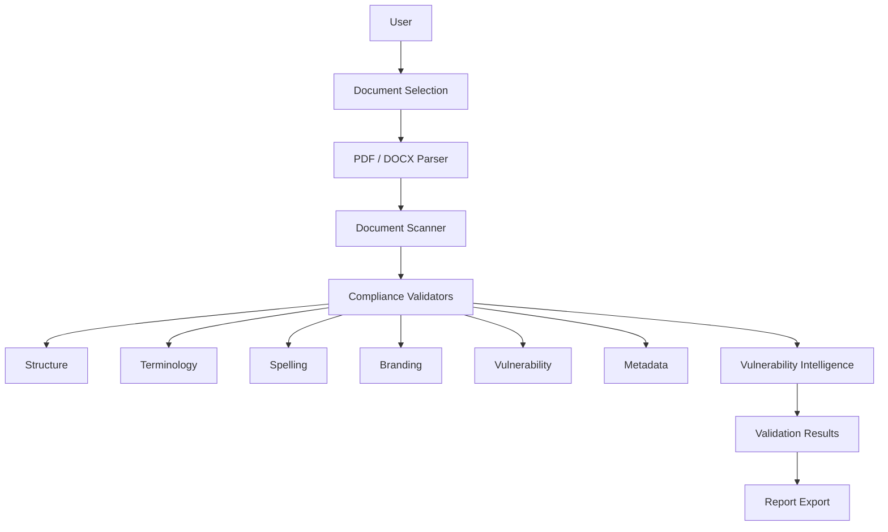

# Document Compliance & Validation Checker

> A desktop cybersecurity application for automated document compliance validation, vulnerability intelligence, and report-quality analysis.


## Project Status

**Version:** 1.0.0  
**Status:** Public Portfolio Release  
**Platform:** Windows  
**Interface:** CustomTkinter  

This repository contains a sanitized public portfolio version of the application.

## Project Context

This application was developed as part of a Cybersecurity Research Internship and focused on automating document compliance, validation, vulnerability intelligence, and report-quality analysis for cybersecurity workflows.

The public repository contains a sanitized portfolio version. Organization-specific documents, logos, runtime data, and confidential material have been excluded.

## My Role

**Cybersecurity Research Intern & Developer**

My contributions to this project included:
- Architecting the application and document-processing pipeline
- Developing the compliance validation engine and vulnerability intelligence knowledge base
- Implementing branding validation using computer vision
- Building the report generation module
- Designing and implementing the desktop UI using CustomTkinter
- Managing rules and testing the application
- Packaging the application into a standalone Windows executable using PyInstaller
- Preparing the project for release

## Overview



## Key Capabilities

| Capability | Description |
|---|---|
| PDF/DOCX Analysis | Extracts and analyzes document content |
| Compliance Validation | Applies configurable document rules |
| Vulnerability Intelligence | Matches vulnerability references against a cybersecurity knowledge base |
| Branding Validation | Detects document branding inconsistencies |
| Terminology Checks | Identifies terminology and language issues |
| Document Structure | Validates required sections and page structure |
| Report Generation | Produces analysis results for review |
| Knowledge Base | JSON-driven cybersecurity and validation rules |
| Desktop Interface | CustomTkinter-based Windows application |
| Packaging | PyInstaller standalone executable |

## How It Works

1. **Select** a PDF or DOCX document for analysis.
2. **Parse** the document content and structure.
3. **Run** compliance and security validators on the extracted data.
4. **Match** relevant vulnerability intelligence from the knowledge base.
5. **Analyze** branding and document consistency.
6. **Present** the findings in the interactive desktop dashboard.
7. **Export** the comprehensive results as a PDF, DOCX, or TXT report.

## Technology Stack

### Application
- Python
- CustomTkinter

### Document Processing
- PyMuPDF
- python-docx

### Computer Vision / Branding
- OpenCV
- Image Hashing (pHash + ORB)

### Reporting
- ReportLab
- python-docx

### Packaging
- PyInstaller

## Engineering Highlights

- **Modular Service Architecture:** Decoupled UI, parsing, and validation logic.
- **Parser Abstraction:** Unified interface for different document formats.
- **Validator Architecture:** Extensible rule-based validation engine.
- **JSON-Driven Rule System:** Configurable knowledge base without code changes.
- **Local Processing:** No external network calls during validation.
- **Background Processing:** Multi-threaded report generation.
- **Configurable Knowledge Base:** Supports dynamic rule updates.
- **Report Export Pipeline:** Multi-format output generation.
- **PyInstaller Packaging:** Standalone distribution.
- **Runtime Data Isolation:** Clean separation of state and source code.

## Project Structure

```
app/
├── parsers/        # Document extraction logic (PDF/DOCX)
├── services/       # Core business logic (Scanner, Branding, Export, Rules)
├── ui/             # CustomTkinter interface components and pages
├── utils/          # Helper utilities
└── validators/     # Compliance and security validation rules

assets/             # Application icons and imagery
rules/              # JSON-based cybersecurity knowledge base

README.md           # Project documentation
requirements.txt    # Python dependencies
ComplianceChecker.spec # PyInstaller build specification
run.py              # Application entry point
```

## Installation

```bash
# Clone the repository
git clone https://github.com/PratikDas-VTU/Document-Compliance-Validation-Checker.git
cd Document-Compliance-Validation-Checker

# Create and activate a virtual environment
python -m venv .venv
.venv\Scripts\activate

# Install dependencies
pip install -r requirements.txt
```

## Usage

Run the application from the source code:
```bash
python run.py
```

## Build / Packaging

To build the standalone Windows executable:
```bash
pyinstaller ComplianceChecker.spec
```

## Security & Privacy

- Processing is performed locally to ensure data confidentiality.
- Runtime data is separated from public source files.
- Credentials and secrets are not included in the repository.
- Organization-specific documents, logos, and sensitive development artifacts were completely removed.
- This public repository represents a sanitized portfolio release.

## Known Limitations

- **UI Rendering:** The CustomTkinter scrollable interface may exhibit minor layout fluctuation under aggressive window resizing.
- **Duplicate Rendering:** Navigating away from and back to a completed scan result page currently re-triggers the results rendering logic (cosmetic).
- **Packaging:** Currently optimized and tested primarily for Windows.
- **Parsing Limitations:** Image-only (scanned) PDFs are not supported as OCR is not currently implemented.

## Roadmap

- [ ] UI rendering optimization
- [ ] Improved resize performance
- [ ] Expanded document format support
- [ ] More compliance rule templates
- [ ] Improved automated testing
- [ ] Cross-platform packaging investigation
- [ ] Enhanced reporting and visualization

## License / Usage

This repository is published as a portfolio artifact. No open-source license is currently granted for reuse, redistribution, or derivative works.
